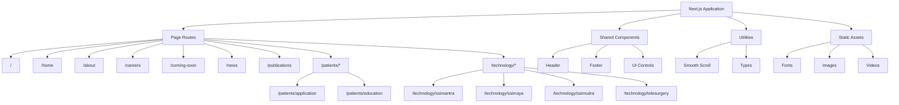

# SSI Surgical Systems Website

A professional enterprise website built for SSI Surgical Systems to showcase its advanced surgical robotics and extended reality platforms.

## Technology Stack

### Core Platform

- **Next.js 16 App Router** - modern server-client architecture, route-based rendering, and built-in performance optimizations
- **React 19** - latest React framework for interactive UI and improved rendering
- **TypeScript 5** - strong typing across pages, components, and utilities

### Styling and UI

- **Tailwind CSS** - utility-first styling for consistent, maintainable UIs
- **Framer Motion** - animation support for smooth transitions and dynamic UI behavior
- **PostCSS** - CSS processing and autoprefixing for browser compatibility

### Graphics and Visualization

- **Three.js** - 3D rendering engine for product and surgical visuals
- **React Three Fiber** - declarative Three.js integration within React
- **React Three Drei** - reusable 3D primitives and helpers for React Three Fiber

### Performance and UX

- **Next.js Image Optimization** - responsive image delivery with automatic format selection
- **Lazy Loading / Dynamic Imports** - deferred loading for non-critical sections
- **Self-hosted Fonts** - optimized font delivery for faster rendering

### Quality and Tooling

- **ESLint** - code quality and consistency enforcement
- **TypeScript Compiler** - compile-time type safety and validation
- **Tailwind Configuration** - design tokens and responsive styling controls

## Architecture Overview

The project uses a clean, file-based Next.js App Router structure. Pages are separated by route, and each section is implemented as a reusable component.

### Key Directories

- `app/` - top-level route definitions and page layouts
- `components/` - reusable page sections and shared UI components
- `components/ui/` - shared interface components like buttons and lazy loaders
- `components/common/` - site-wide layout elements such as header and footer
- `components/home/` - home page sections and marketing modules
- `components/about/` - corporate and brand storytelling sections
- `components/careers/` - careers and company culture sections
- `components/technology/` - dedicated product pages for SSI Mantra, SSI Maya, SSI Mudra, and Telesurgery
- `lib/` - utility helpers and scroll behavior implementation
- `types/` - shared TypeScript type definitions
- `constants/` - theme and navigation constants
- `public/` - fonts, images, logos, and videos

### Page Routes and Content Map

- `/` - root or landing experience
- `/home` - core hero messaging, product overview, features, technology showcase, video, and demo call-to-action
- `/about` - company mission, leadership, history, and global footprint
- `/careers` - open roles, culture, facilities, and FAQ
- `/coming-soon` - announcement placeholder page
- `/news` - news, updates, and industry insights
- `/publications` - publications and research highlights
- `/patients/application` - clinical application narrative and patient-focused value
- `/patients/education` - training, education resources, and system overviews
- `/technology/ssimantra` - SSI Mantra surgical robotics product page
- `/technology/ssimaya` - SSI Maya extended reality platform page
- `/technology/ssimudra` - SSI Mudra robotics and control platform page
- `/technology/telesurgery` - telesurgery solution overview and capabilities page

### Component Structure

#### Shared Components

- `components/common/header.tsx` - site navigation and top bar
- `components/common/footer.tsx` - footer navigation and legal links
- `components/ui/Button.tsx` - reusable button component
- `components/ui/LazySection.tsx` - intersection observer based lazy loader for below-the-fold content

#### Home Page Components

- `components/home/HeroSection.tsx` - hero messaging and brand positioning
- `components/home/OverviewSection.tsx` - product and service overview
- `components/home/FeaturesSection.tsx` - feature showcase and benefits
- `components/home/TechnologiesSection.tsx` - product technology highlights
- `components/home/WhoWeAreSection.tsx` - company identity and values
- `components/home/VideoSection.tsx` - media presentation section
- `components/home/BookDemoSection.tsx` - lead generation and contact CTA
- `components/home/ProductShowcaseSection.tsx` - product showcase visuals

#### Technology Page Components

- `components/technology/ssimantra/HeroSection.tsx` - SSI Mantra introduction
- `components/technology/ssimantra/OverviewSection.tsx` - product specification details
- `components/technology/ssimantra/GallerySection.tsx` - product gallery and visuals
- `components/technology/ssimaya/HeroSection.tsx` - SSI Maya platform introduction
- `components/technology/ssimaya/FeaturesSection.tsx` - SSI Maya capabilities and differentiators
- `components/technology/ssimaya/MayaFutureSection.tsx` - future use case storytelling
- `components/technology/ssimaya/MayaTeleproctoringSection.tsx` - teleproctoring demonstrations
- `components/technology/ssimudra/MudraSection.tsx` - system introduction
- `components/technology/ssimudra/MudraFeaturesSection.tsx` - feature breakdown
- `components/technology/ssimudra/MudraFaqSection.tsx` - FAQs and support details
- `components/technology/telesurgery/TelesurgerySection.tsx` - telesurgery overview
- `components/technology/telesurgery/TelesurgeryDetailsSection.tsx` - detailed capabilities
- `components/technology/telesurgery/PublicationSection.tsx` - publications and research summary
- `components/technology/telesurgery/FAQSection.tsx` - frequently asked questions
- `components/technology/telesurgery/BookDemoSection.tsx` - demo call-to-action

## Architecture Diagram



## Development

Install dependencies:

```bash
npm install
```

Start the development server:

```bash
npm run dev
```

Build for production:

```bash
npm run build
```

## Notes

- The repository follows a component-driven design with route-level organization.
- Non-critical sections are loaded lazily for improved performance.
- Styling is centralized through Tailwind and a shared theme configuration.
